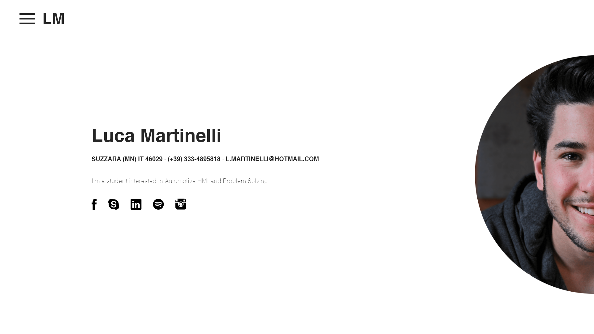
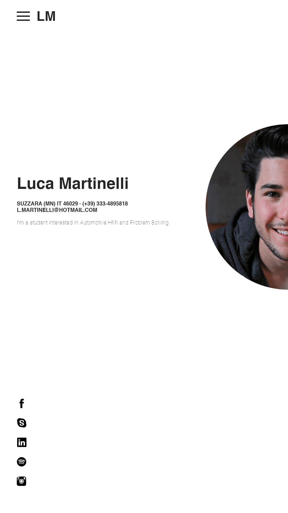
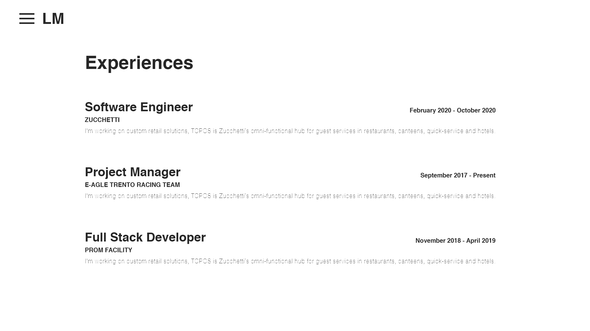
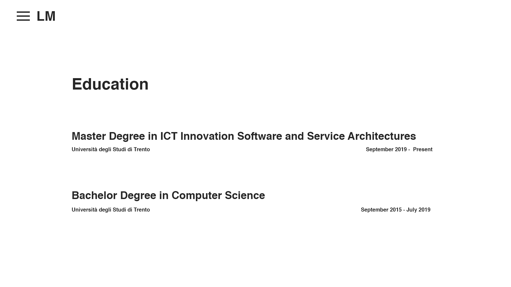
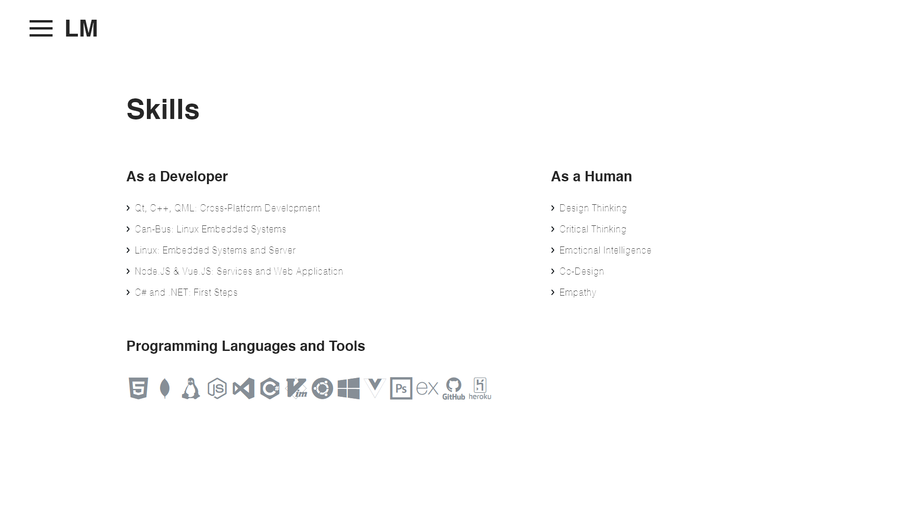

[](https://forthebadge.com)

# Me coding my resume trying to get a job []

> My online-resume 


This is the first version, my long-term goal is to build my own version with an AdobeXD template designed by me. Check it below!

## Homepage



## Homepage - Mobile



## Experiences



## Experiences - Mobile


## Education



## Education - Mobile


## Skillss



## Skills - Mobile


## Project setup
```
npm i
```

### Compiles and hot-reloads for development
```
npm run serve
```

### Compiles and minifies for production
```
npm run build
```

